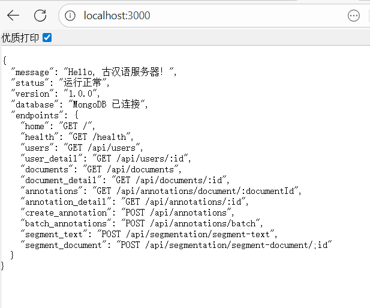

# 古汉语智能标注平台

## 项目简介
基于 Node.js + Express + MongoDB 的古汉语文本智能标注平台，支持文档管理、自动分词、手动标注等功能。

## 功能特性
-  用户管理系统
-  古汉语文档管理  
-  智能自动分词
-  手动标注功能
-  批量标注处理
-  数据统计展示

## 技术栈
- 后端: Node.js, Express, MongoDB, Mongoose
- 工具: Nodemon, Thunder Client

## 安装运行

### 环境要求

|  组件   | 版本要求  |  备注  |
|---------|----------|--------|
| Node.js |  14.0+   | [下载地址](https://nodejs.org/) |
| MongoDB |   4.4+   | [下载地址](https://www.mongodb.com/try/download/community) |
|   npm   |   6.0+   | 通常随 Node.js 安装 |

### 启动步骤
1. 安装依赖: `npm install`

2. 启动MongoDB服务：
-Windows 系统-
net start MongoDB

-macOS 系统 (使用 Homebrew)-
brew services start mongodb-community

-Linux 系统-
sudo systemctl start mongod

3. 运行项目: 
# 开发模式（推荐）
npm run dev

# 或生产模式
npm start

4. 访问: `http://localhost:3000`

5. 验证安装
打开浏览器访问：http://localhost:3000

你应该看到类似这样的 JSON 响应：

json
{
  "message": "Hello, 古汉语服务器！",
  "status": "运行正常",
  "version": "1.0.0",
  "database": "MongoDB 已连接",
  "endpoints": {...}
}

  

## API文档

### 用户管理
- `GET /api/users` - 获取用户列表
- `POST /api/users` - 创建用户

### 文档管理  
- `GET /api/documents` - 获取文档列表
- `POST /api/documents` - 创建文档
- `GET /api/documents/:id` - 获取文档详情

### 标注系统
- `POST /api/annotations` - 创建标注
- `POST /api/annotations/batch` - 批量创建标注
- `GET /api/annotations/document/:id` - 获取文档标注

### 智能分词
- `POST /api/segmentation/segment-text` - 文本分词
- `POST /api/segmentation/segment-document/:id` - 文档自动标注

